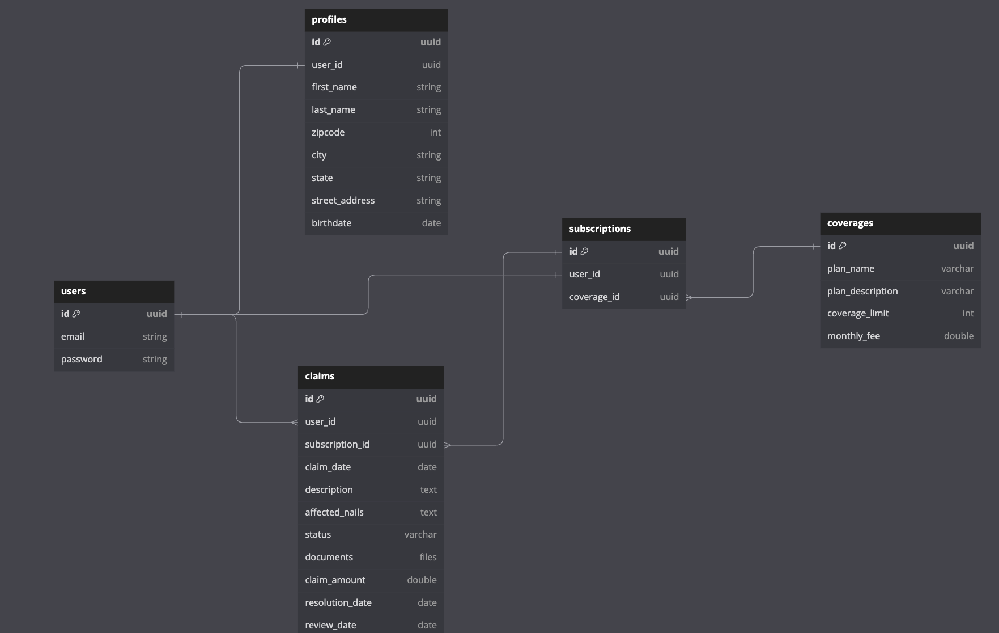

# NailSurent - Nail Insurance Backend

## Project description

NailSurent is a Spring Boot backend application designed to provide nail insurance services to users. This backend is the core of the NailSurent system, handling user registration, subscription management, claim filing, and more. It offers users the ability to select and manage their insurance plans, file claims for nail services, and view their insurance plan information and claims history.

## User Stories

1. **Registration**:
    - As a user, I want to register for an account to subscribe for nail insurance, so that I can access coverage for nail services.
    - **Acceptance Criteria**:
        - The registration process should include fields for the user's name, email, and password.
        - Users should receive a confirmation email to verify their account.
        - After successful registration, users should be able to log in with their credentials.

2. **Subscription to Plans**:
    - As a user, I want to subscribe to a specific insurance plan (Basic, Standard, or Premium), so that I can choose the coverage that suits my needs.
    - **Acceptance Criteria**:
        - The app should display the available plans with details, including coverage limits and pricing.
        - Users should be able to select a plan and subscribe to it.
        - Upon subscription, the app should confirm the selected plan and payment details.

3. **View Plan Information**:
    - As a user, I want to view my insurance plan information, so that I can understand the coverage and terms of my plan.
    - **Acceptance Criteria**:
        - Users should have a dedicated section displaying their active insurance plan details.
        - This section should include information about coverage limits, deductible, and effective dates.
        - Users should be able to access this information at any time after subscribing.

4. **Filing a Claim**:
    - As a user, I want to file a claim for nail services, so that I can request coverage for unexpected issues.
    - **Acceptance Criteria**:
        - Users should have a "File a Claim" option within the app.
        - The claim form should include fields for details such as the service date, description of the incident, and supporting documents.
        - Users should receive confirmation of claim submission.

5. **View Claims**:
    - As a user, I want to view all my filed claims, so that I can track the progress and history of my claims.
    - **Acceptance Criteria**:
        - The app should provide a section where users can access a list of all their filed claims.
        - For each claim, users should be able to see its status (e.g., pending, approved, denied) and related details.
        - Users should have the ability to select and view specific claims for more information.

## ERD Diagram



## Tools and Technologies Used

- Java
- Spring Boot
- Docker

## Installation Guide

Clone the Repository:

```
git clone https://github.com/your-username/your-nailsurent-repo.git
```

Navigate to the Project Directory:

```
cd nailcare
```

Configure Application Properties:

Open the application.properties or application.yml file to configure database settings, security, and other application-specific properties.

Build the Application:

```
./mvnw clean install
```
Run the Application:

```
./mvnw spring-boot:run
```
Access the Application:

The application should be accessible at http://localhost:4000 by default.
API Endpoints Documentation:

Refer to the API documentation to understand available endpoints and how to use them. You can access the API documentation at API Endpoints Documentation.

## API Endpoints

[Link to API Endpoints Documentation](endpoints.png)

## Challenges Faced

One of the key challenges faced during the development of NailSurent was implementing security features to ensure user data and transactions were protected. This involved setting up user authentication, authorization, and securing API endpoints.

Another significant achievement was building the "Create Claims" feature within the claims service, allowing users to submit claims for nail services efficiently.

## Key Achievements

- Successful implementation of security features for user authentication and authorization.
- Development of the "Create Claims" feature, enabling users to file claims for nail services.
- Providing a user-friendly interface for users to manage their subscriptions, view plan information, and track their claim's history.

---

NailSurent - Nail Insurance Backend is part of the NailSurent project, which aims to provide users with peace of mind by offering nail insurance coverage for unexpected events during nail services.
